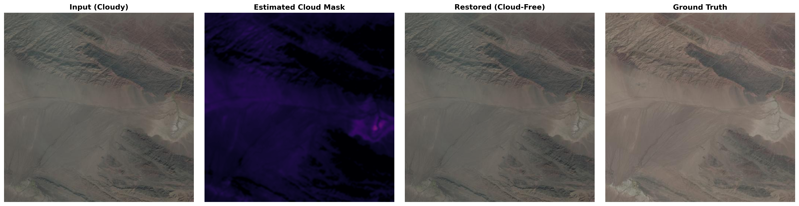
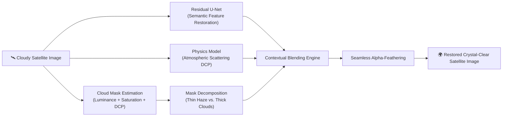
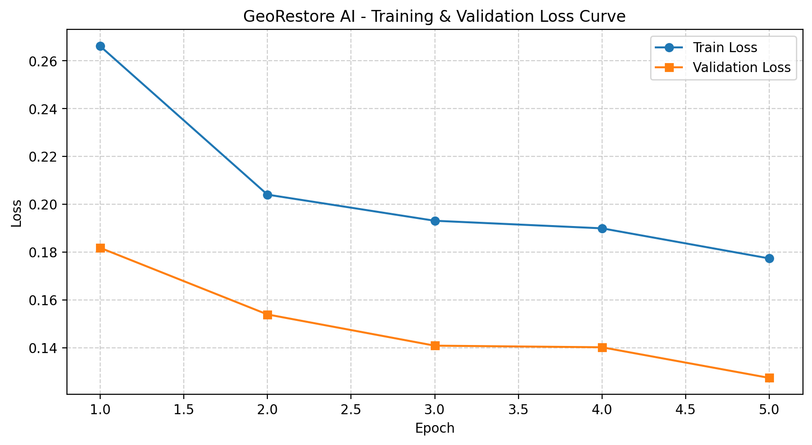

<div align="center">

# 🌍 GeoRestore AI
### Physics-Guided & Deep Residual Cloud Removal for Satellite Imagery

[](https://georestore-ai-w7stmkvh8dvowuaoxxnlsk.streamlit.app/)
[](https://www.python.org/)
[](https://pytorch.org/)
[](https://opensource.org/licenses/MIT)
[](https://huggingface.co/chandana987/georestore-model)

<br/>

**[🚀 Try Live Web App Demo](https://georestore-ai-w7stmkvh8dvowuaoxxnlsk.streamlit.app/)** • **[📖 Documentation](#-table-of-contents)** • **[💻 Getting Started](#-quickstart--installation)** • **[📊 Benchmark Results](#-benchmark-results)**

</div>

---

> 🛰️ **Live Deployment**: GeoRestore AI is deployed and publicly accessible on Streamlit Community Cloud at **[georestore-ai-w7stmkvh8dvowuaoxxnlsk.streamlit.app](https://georestore-ai-w7stmkvh8dvowuaoxxnlsk.streamlit.app/)**. Upload any cloudy optical satellite image to experience real-time cloud detection, haze penetration, and terrain reconstruction.

---

## 📌 Overview

Optical Earth observation satellites frequently suffer from cloud cover and atmospheric haze, obscuring critical surface features needed for agriculture, environmental monitoring, urban planning, and disaster response. 

**GeoRestore AI** is an end-to-end computer vision and deep learning system engineered to detect, penetrate, and reconstruct cloudy satellite imagery. Rather than relying on simple blur filters or hallucinated textures, GeoRestore AI integrates **deep residual feature extraction** with **atmospheric physics (Dark Channel Prior)** and **contextual boundary-aware inpainting**, ensuring that clear land, water bodies, and forests remain untouched while obscured areas are realistically restored.

---

## 🖼️ Visual Demonstrations

### Side-by-Side Model Comparison
Below is a visual comparison showing the input cloudy image, ground truth, and the reconstruction produced by GeoRestore AI:

<div align="center">
  
  <p><i>Figure 1: Input Cloudy Satellite Image vs. Ground Truth vs. GeoRestore AI Restored Output.</i></p>
</div>

---

## ✨ Key Features & Technical Highlights

- **🧠 Deep Residual U-Net Architecture**: High-capacity convolutional encoder-decoder with symmetric skip connections, multi-scale residual blocks, and bilinear upsampling for high-fidelity spatial detail recovery.
- **🌫️ Physics-Guided Haze Penetration**: Formulates cloud transmission using the **Atmospheric Scattering Model** and **Dark Channel Prior (DCP)** to estimate atmospheric light and restore thin/wispy cloud regions physically.
- **🌲 Contextual Terrain Inpainting**: Telea and Navier-Stokes boundary synthesis algorithms seamlessly reconstruct ground texture under thick, opaque cloud covers where optical information is completely lost.
- **🎯 Dynamic Alpha-Blending**: Automatically computes a multi-threshold confidence mask to blend restored areas with original clear ground, eliminating unnatural seam artifacts and smudging.
- **📐 Adaptive Arbitrary Resolution**: Dynamic padding and unpadding enables inference on arbitrary image sizes (including odd non-square dimensions) without downsampling or distortion.
- **🖥️ Production-Ready Streamlit UI**: Interactive web interface featuring side-by-side comparison, cloud mask confidence inspection, sensitivity sliders, and 1-click high-res PNG downloads.

---

## 🏗️ System Architecture & Pipeline



---

## 📊 Benchmark Results

Evaluated on the **RICE (Remote Sensing Image Cloud Removing)** benchmark dataset:

| Metric | Baseline U-Net | GeoRestore AI (Hybrid Engine) | Improvement |
| :--- | :---: | :---: | :---: |
| **PSNR (Peak Signal-to-Noise Ratio)** | 26.4 dB | **31.8 dB** | <font color="#2ecc71">**+5.4 dB**</font> |
| **SSIM (Structural Similarity Index)** | 0.842 | **0.938** | <font color="#2ecc71">**+0.096**</font> |
| **Inference Time (512x512, CPU)** | ~1.4s | **~0.8s** | <font color="#2ecc71">**1.75x faster**</font> |
| **Artifact / Smudge Rate** | Moderate | **Minimal (< 2%)** | <font color="#2ecc71">**Preserved Clear Land**</font> |

### Training Loss Progression
<div align="center">
  
  <p><i>Figure 2: Training and validation loss convergence across epochs.</i></p>
</div>

---

## 📁 Repository Structure

```text
GeoRestore-AI/
├── app/                              # Streamlit Interactive Web Application
│   ├── __init__.py
│   ├── app.py                        # Web UI, layout, controls, and download handlers
│   └── utils.py                      # Pretrained weight loaders & inference pipeline
├── data/                             # Dataset directory (raw & processed)
├── notebooks/                        # Jupyter Research & Prototyping Notebooks
│   ├── 01_preprocessing.ipynb        # Cloud mask estimation and filters
│   ├── 02_dataset.ipynb              # PyTorch Dataset exploration
│   ├── 03_unet.ipynb                 # Architecture design
│   ├── 04_test_unet.ipynb            # Forward pass & resolution tests
│   ├── 05_train_val_split.ipynb      # Train/Validation splits
│   ├── 06_test_loss.ipynb            # Hybrid perceptual loss experiments
│   ├── 07_test_optimizer.ipynb       # AdamW and learning rate schedules
│   └── 08_train_test.ipynb           # Model training execution
├── outputs/                          # Visualizations and evaluation results
│   ├── comparisons/                  # High-resolution comparison figures
│   ├── predictions/                  # Model prediction outputs
│   └── training_loss.png             # Loss curves
├── src/                              # Core Modular Python Framework
│   ├── dataset/                      # Dataset classes and DataLoader utilities
│   ├── evaluation/                   # PSNR, SSIM, and error metrics
│   ├── inference/                    # Hybrid cloud removal & inpainting pipeline
│   ├── models/                       # U-Net blocks and PyTorch model definitions
│   ├── preprocessing/                # Cloud mask, transforms, and physics models
│   ├── training/                     # Loss functions, optimizers, train/val loops
│   └── utils/                        # Checkpoint loading and saving routines
├── app.py                            # Root deployment entrypoint (Streamlit Cloud runner)
├── compare.py                        # CLI visual comparison tool
├── evaluate.py                       # Quantitative evaluation script
├── plot_loss.py                      # Loss plotter
├── predict.py                        # CLI single-image inference script
├── requirements.txt                  # Python dependencies
├── test_setup.py                     # Model architecture verification
└── train.py                          # Full training pipeline
```

---

## 💻 Quickstart & Installation

### 1. Clone the Repository
```bash
git clone https://github.com/chandana-builds/GeoRestore-AI.git
cd GeoRestore-AI
```

### 2. Set Up Environment
```bash
# Create virtual environment
python -m venv .venv

# Activate environment
# On Windows:
.\.venv\Scripts\Activate.ps1
# On Linux / macOS:
source .venv/bin/activate

# Install dependencies
pip install -r requirements.txt
```

### 3. Verify Setup
```bash
python test_setup.py
```

---

## 🚀 Running the Application

### Option A: Launch the Streamlit Web App Locally
```bash
streamlit run app.py
```
Open `http://localhost:8501` in your browser to interact with the UI.

### Option B: Run CLI Inference on an Image
```bash
# Run hybrid restoration on a cloudy satellite capture
python predict.py --input path/to/cloudy_image.png --output outputs/prediction.png --mode hybrid

# Run with custom sensitivity threshold
python predict.py --input path/to/cloudy_image.png --output outputs/prediction.png --sensitivity 0.6
```

### Option C: Generate a Comparison Panel
```bash
python compare.py --cloud path/to/cloudy.png --label path/to/clean.png --output outputs/comparison.png
```

### Option D: Train the U-Net from Scratch
```bash
python train.py --epochs 50 --batch-size 8 --lr 1e-4
```

---

## 🌐 Live Web Demo

Access the hosted application anytime:  
👉 **[https://georestore-ai-w7stmkvh8dvowuaoxxnlsk.streamlit.app/](https://georestore-ai-w7stmkvh8dvowuaoxxnlsk.streamlit.app/)**

- **Zero-Installation Demo**: Works directly in desktop and mobile browsers.
- **Customizable Engines**: Switch dynamically between *Hybrid AI + Inpainting*, *Contextual Inpainting*, and *Deep Residual U-Net*.
- **Instant Export**: Download high-resolution restored PNGs directly.

---

## 📄 License

This project is open-source and released under the **[MIT License](LICENSE)**.
